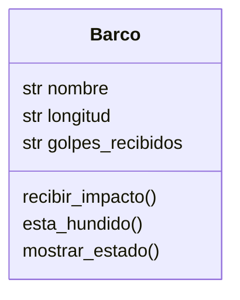
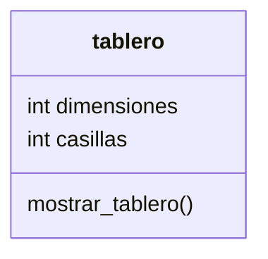

# Tarea: Clases Hundir la Flota

## Anxo Vázquez Lorenzo

## Clase Barco

```mermaid
classDiagram
direction TB
    class Barco {
	    str nombre
	    str longitud
	    str golpes_recibidos
	    recibir_impacto()
	    esta_hundido()
	    mostrar_estado()
    }
```

## Clase Tablero

```mermaid
classDiagram
direction TB
    class tablero {
	    int dimensiones
	    int casillas
	    mostrar_tablero()
    }
```